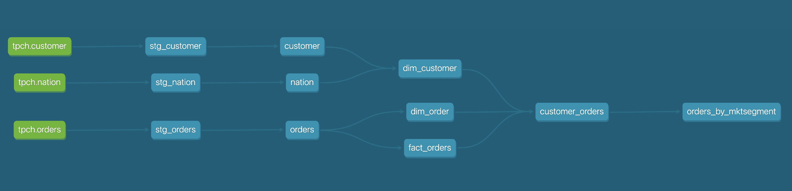

# Databricks dbt demo

## Overview

Builds staging, base, and datamart models from the TPCH dataset

## Model lineage



## Basic Usage

You will use the TPCH sample data that is already installed on the Databricks cluster. To verify the sample data is installed, follow the steps here:

- a
- b
- c

## Advanced Usage

In this section, you will generate the TPCH data, upload the data into Databricks dbfs, and then load the data into stating tables using Delta Live Tables.

Follow these steps:

- Run the `tpch_datagen.py` Python script on a VM that has ~500GB of available memory and ~100GB of free disk space. This will generate the Parquet files needed for this demo.
- Copy the Parquet data files to Databricks dbfs using the [Databricks CLI](https://docs.databricks.com/dev-tools/cli/index.html). Put each data file in a folder of the same dataset name.
- Be sure to shut down the VM when you are finished uploading the data to Databricks to avoid incurring unnecessary costs.

## Using the demo project

Getting set up:

- Create a Python virtual environment
- Install the [dbt-databricks](https://github.com/databricks/dbt-databricks) adapter, which will also install a compatible version of dbt-core
- Create an entry in your dbt profiles.yml file, Azure Databricks example is shown below using a SQL warehouse.

- If you do not have a Databricks access token, follow the steps in the [Databricks documentation](https://docs.databricks.com/dev-tools/auth.html) to create one.

```text
databricks_dbt_demo:
  outputs:
    dev:
      catalog: null
      host: adb-1111111111111111.1.azuredatabricks.net
      http_path: /sql/1.0/warehouses/abcdef1234567890
      schema: dbxdemo
      threads: 1
      token: xxxxxxxxxxxxxxxxxxxxxxxxxxxxxxxxxxxx
      type: databricks
  target: dev
```

Try running the following commands:

- dbt deps
- dbt build


## Resources:

- Learn more about dbt [in the docs](https://docs.getdbt.com/docs/introduction)
- Check out [Discourse](https://discourse.getdbt.com/) for commonly asked questions and answers
- Join the [chat](https://community.getdbt.com/) on Slack for live discussions and support
- Find [dbt events](https://events.getdbt.com) near you
- Check out [the blog](https://blog.getdbt.com/) for the latest news on dbt's development and best practices
