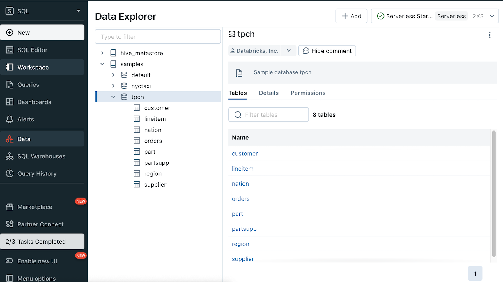
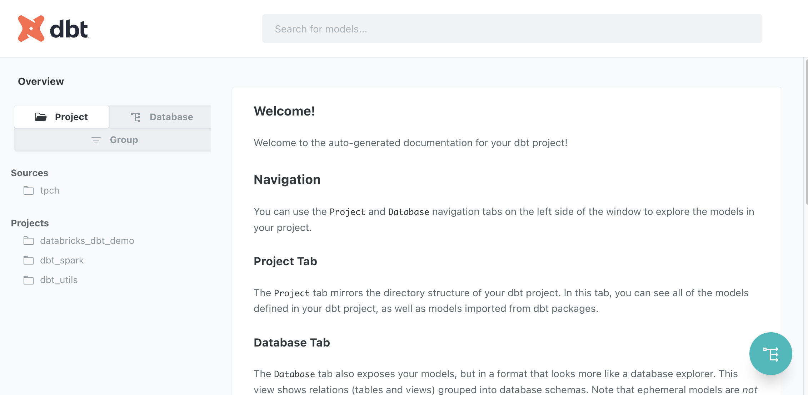

# databricks-dbt-demo

Get started quickly with [Databricks](https://www.databricks.com/) and [dbt](https://www.getdbt.com/). Download the code and build your own models on top of the [TPCH dataset](https://www.tpc.org/tpch/). You can use the sample TPCH data included with a Databricks cluster, or generate your own using the included Python script.

## Model lineage

This demo will build the model lineage shown below using `dbt`. You can generate this and a full set of documenation by running `dbt docs generate` on your machine. More info can be found [here](https://docs.getdbt.com/reference/commands/cmd-docs).


## Getting started

Python setup:

- Create a Python 3.8+ [virtual environment](https://docs.python.org/3/library/venv.html) anywhere you have access to a shell prompt. The demo was built and tested on Python 3.8.10, use this version for best results.

- Clone this code repo to wherever you created the Python environment and `cd` into the repo directory.

- Install the [dbt-databricks](https://github.com/databricks/dbt-databricks) adapter, which will also install a compatible version of dbt-core. You can use `pip` or whatever Python package management tool you like.

Databricks setup:

- If you do not have a Databricks access token, follow the steps in the [Databricks documentation](https://docs.databricks.com/dev-tools/auth.html) to create one. Store the token securely and refer to it in the next steps.

dbt setup:

- Create an entry in your dbt profiles.yml file, an Azure Databricks example is shown below using a Serverless SQL warehouse. Serverless SQL warehouses are recommended for best demo performance and startup times.

```text
databricks_dbt_demo:
  outputs:
    dev:
      catalog: null
      host: adb-1111111111111111.1.azuredatabricks.net
      http_path: /sql/1.0/warehouses/abcdef1234567890
      schema: dbxdemo
      threads: 1
      token: xxxxxxxxxxxxxxxxxxxxxxxxxxxxxxxxxxxx
      type: databricks
  target: dev
```

## Basic demo

In the Basic Demo, you will use the sample TPCH data that is already installed on the Databricks cluster. It's typically generated at a scale factor of 10, which equates to ~10 gigabytes. See the [TPCH documentation](https://www.tpc.org/tpc_documents_current_versions/current_specifications5.asp) for more information.

To verify the sample data is installed, go the the "SQL" persona and click the "Data" icon in the left menu bar. You should see the `tpch` schema and tables under the `sample` database.



Continue below to [Demo steps](#demo-steps).

## Advanced demo

In the Advanced Demo, you will generate the TPCH data, upload the data into Databricks dbfs, and then load the data into stating tables using Delta Live Tables. This section currently describes the process at a high-level. It assumes a working knowledge of Python, Delta Live Tables and the Databricks CLI. Sample Delta Live Tables notebooks will be included in a future release of this demo.

Follow these steps to generate and upload the data to Databricks:

- Run the `tpch_datagen.py` Python script on a VM that has ~500GB of available memory and ~100GB of free disk space. This will generate the Parquet files needed for this demo.
- If the script crashes, there's a good chance you ran out of memory or disk space.
- Copy the Parquet data files to Databricks dbfs using the [Databricks CLI](https://docs.databricks.com/dev-tools/cli/index.html). Put each data file in a folder of the same dataset name.
- Be sure to shut down the VM when you are finished uploading the data to Databricks to avoid incurring unnecessary costs.

Continue below to [Demo steps](#demo-steps).

## Demo steps

Try running the following commands:

- `dbt deps`
- `dbt build`

This will install the [dbt dependencies](https://docs.getdbt.com/reference/commands/deps) and [build](https://docs.getdbt.com/reference/commands/build) the dbt models. It will also automatically run all tests. The Databricks SQL warehouse will start up if it is not already started.

Successful output should look similar to this. Performance will depend on TPCH data volume and Databricks warehouse size:

```bash
...
00:26:04  76 of 83 PASS not_null_orders_o_orderkey ....................................... [PASS in 0.45s]
00:26:04  77 of 83 START test unique_orders_o_orderid .................................... [RUN]
00:26:06  77 of 83 PASS unique_orders_o_orderid .......................................... [PASS in 2.23s]
00:26:06  78 of 83 START test unique_orders_o_orderkey ................................... [RUN]
00:26:07  78 of 83 PASS unique_orders_o_orderkey ......................................... [PASS in 0.98s]
00:26:07  79 of 83 START sql table model dbxdemo_datamart.dim_customer ................... [RUN]
00:26:13  79 of 83 OK created sql table model dbxdemo_datamart.dim_customer .............. [OK in 5.95s]
00:26:13  80 of 83 START sql table model dbxdemo_datamart.dim_order ...................... [RUN]
00:26:19  80 of 83 OK created sql table model dbxdemo_datamart.dim_order ................. [OK in 5.53s]
00:26:19  81 of 83 START sql table model dbxdemo_datamart.fact_orders .................... [RUN]
00:26:23  81 of 83 OK created sql table model dbxdemo_datamart.fact_orders ............... [OK in 4.81s]
00:26:23  82 of 83 START sql table model dbxdemo_datamart.customer_orders ................ [RUN]
00:26:38  82 of 83 OK created sql table model dbxdemo_datamart.customer_orders ........... [OK in 14.25s]
00:26:38  83 of 83 START sql table model dbxdemo_datamart.orders_by_mktsegment ........... [RUN]
00:26:41  83 of 83 OK created sql table model dbxdemo_datamart.orders_by_mktsegment ...... [OK in 3.68s]
00:26:42  
00:26:42  Finished running 62 tests, 21 table models in 0 hours 2 minutes and 26.01 seconds (146.01s).
00:26:42  
00:26:42  Completed successfully
00:26:42  
00:26:42  Done. PASS=83 WARN=0 ERROR=0 SKIP=0 TOTAL=83
user@localhost ~/d/databricks-dbt-demo (main)> 
```

Run these commands to generate the documentaion and serve it in a web browser:

- `dbt docs generate`
- `dbt docs serve`



## Resources

- Learn more about dbt [in the docs](https://docs.getdbt.com/docs/introduction)
- Check out [Discourse](https://discourse.getdbt.com/) for commonly asked questions and answers
- Join the [chat](https://community.getdbt.com/) on Slack for live discussions and support
- Find [dbt events](https://events.getdbt.com) near you
- Check out [the blog](https://blog.getdbt.com/) for the latest news on dbt's development and best practices
